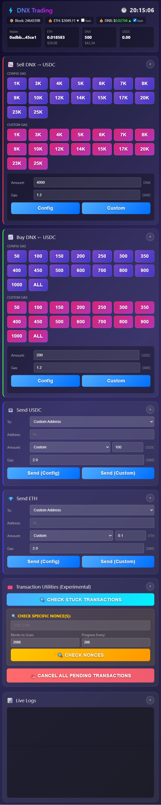

# DNX Swap WebApp — public overview

Operator-focused trading web application for **Dynex (DNX)** on Ethereum: fast DNX⇄USDC swaps, live balances and prices, config-driven gas, and recovery tooling when the chain misbehaves.

**Implementation (private):** [dnx-swap-webapp](https://github.com/logicencoder/dnx-swap-webapp)

---

## The problem

When executing swaps manually in the **Dynex** ecosystem, seconds matter:

- Standard DEX UIs often need multiple screens and confirmations before a trade lands.
- Base fee and priority fee move while you are still typing an amount.
- Nonce desync and stuck pending transactions are common under active use.
- MEV and private builder reliability affect whether a swap confirms at the price you assumed.

I built a **single-page operator runtime** that keeps critical state visible, runs common sizes from presets, and separates “trade now” from “fix the chain” utilities.

---

## Who benefits

| Audience | Benefit |
|----------|---------|
| **Operator / trader** | One screen for balances, prices, block/base fee, presets, and logs while swapping DNX |
| **Reviewer / collaborator** | Clear scope of what is production-ready vs experimental without seeing private keys |
| **Developer adapting the pattern** | Reusable shape: FastAPI + async Web3 + config gas + WebSocket log stream |

---

## How this fits the stack

| Piece | Role |
|-------|------|
| **dnx-swap-webapp** (private) | Full Python/FastAPI source, `.env`, gas JSON, UI config |
| **dnx-swap-webapp-overview** (this repo) | Public product description, screenshot, collaboration contact |
| **MEXC / on-chain feeds** | Price inputs (exchange WebSocket + pool math) — not a separate public repo |

This is **not** a public website product. It runs as a **standalone operator runtime** (browser UI + local/controlled backend). Live marketing pages for LogicEncoder use other repos (gas tracker, MEXC stats, shop plugins).

---

## Delivery mode

- **Primary:** dedicated standalone runtime on operator hardware (SOL production path: `dnx_swap_webapp` / `dnx_swap_webapp_optimized.py`)
- **Not primary:** multi-tenant SaaS or anonymous web signup

---

## Capabilities (detailed)

### Preset-driven sell / buy workflow

**What:** Two cards — **Sell DNX → USDC** and **Buy DNX ← USDC** — with preset amount buttons (16 sell sizes, 15 buy sizes), optional custom amount, and an **ALL** buy using full USDC balance (rounded down to avoid dust failures).

**Why:** Active trading needs one-click sizes you repeat daily; typing amounts on every swap adds delay and errors.

**Who benefits:** Operator executing repeated DNX size ladders during volatile sessions.

### Config vs custom gas modes

**What:** Each card supports **Config Gas** (reads `dnx_swap_gas_config.json` ranges) or **Custom Gas** (operator override). Same presets work in both modes.

**Why:** Small trades and large trades need different priority fee / base-fee multiplier profiles; overrides are still needed when the JSON table is behind the market.

**Who benefits:** Operator balancing confirmation speed vs fee spend per trade size.

### Range-based gas engine

**What:** JSON maps trade amount → priority fee (gwei) and base fee multiplier. Fixed gas limits: DNX sell 310k, USDC buy 280k, USDC send 65k, ETH send 21k.

**Why:** Ethereum base fee spikes; a single static gas setting either overpays on small swaps or underpays on large ones.

**Who benefits:** Operator; fewer stuck swaps from underpriced gas on large notionals.

### Live balances, prices, and block context

**What:** Wallet balances (ETH / DNX / USDC) refresh on a short cache interval; prices from **MEXC WebSocket** (protobuf decode) plus on-chain pool math; current block and base fee from a **newHeads** WebSocket (no per-tick `get_block` RPC).

**Why:** You should see cost in USD and chain head state **while** deciding the next button press, not in a separate explorer tab.

**Who benefits:** Operator; reduces trades submitted against stale fee or price assumptions.

### WebSocket log stream

**What:** Backend broadcasts structured events (logs, blocks, prices, balances, swap status) to the browser over WebSocket.

**Why:** Terminal-only logging is useless when the UI is the control surface; the operator needs a live trail next to the buttons.

**Who benefits:** Operator debugging failed swaps or slow confirmations without SSH tailing.

### MEV builder path (BeaverBuild + Titan)

**What:** Persistent HTTP keep-alive to multiple builders, bundle submission across future block slots, keepalive health pings, optional auto-reblast if a tx drops from mempool, summary stats on a configurable interval.

**Why:** Public mempool submission alone is often too slow or too exposed for size ladders the operator runs routinely.

**Who benefits:** Operator chasing reliable inclusion; reviewer evaluating operational sophistication (not consumer DeFi UX).

### Fund transfer utilities

**What:** Send USDC or ETH to preset exchange withdrawal addresses (e.g. MEXC, Gate.io) or a custom recipient, with gas limits tuned per asset.

**Why:** Trading workflow does not end at the swap — proceeds often must move to CEX accounts quickly.

**Who benefits:** Operator consolidating funds after on-chain legs.

### Safety and recovery tooling (experimental)

**What:** Separate UI section: cancel current swap, cancel all pending, nonce inspection, stuck-tx scan (wide block window), transaction status monitoring. Cancel paths use elevated gas multipliers on self-transfers.

**Why:** Nonce gaps and stuck pending txs are operational incidents, not edge cases, during heavy use.

**Who benefits:** Operator recovering from bad chain state; **not** casual users — utilities are marked experimental and need hardening.

**Status:** Experimental — contact before relying on these in unattended automation.

### Attacker-aware block monitoring

**What:** Background block monitor watches for configured hostile addresses and can trigger defensive cancel flows.

**Why:** Known counterparties or bots can front-run or pollute nonce ordering; operator wanted automatic guardrails tied to local node WebSocket.

**Who benefits:** Operator under adversarial mempool conditions (advanced / environment-specific).

### Configuration surface

**What:** `dnx_swap_gas_config.json` for gas ranges, `ui_config.json` for UI presets, `.env` for keys and RPC endpoints (private repo only).

**Why:** Gas tables and button ladders change faster than Python deploy cycles; secrets must never live in the public overview repo.

**Who benefits:** Operator tuning presets without code edits; deployer aligning SOL `.env` with production RPC and builder URLs.

---

## REST / API shape (conceptual)

Private app exposes JSON endpoints for balances, swap execution, sends, gas estimates, nonce status, stuck checks, and cancel actions, plus a WebSocket channel for live operator logs. Exact routes and payloads are documented in the private repo `ARCHITECTURE.md`.

---

## Adapting to other tokens or pairs

**What:** Same architecture can target other ERC-20 pairs by swapping token metadata, pool routing, preset ladders, and gas range tables.

**Why:** The product is a **pattern** (preset UI + config gas + async executor + log stream), not a single immutable DNX binary.

**Who benefits:** Collaborators building similar operator tools on other assets.

---

## What this overview does not include

- Private keys, RPC URLs, builder API secrets, or `.env` templates  
- Full Python source, protobuf schemas, or deployment scripts on SOL  
- Guarantees that experimental cancel / stuck-tx tools are production-complete  

Request sanitized demos or cooperation via contact below.

---

## Development priorities (honest)

- Finish hardening experimental transaction utilities  
- Stronger error recovery and operator-facing failure messages  
- Deployment monitoring story beyond single-operator runtime  

---

## Related repositories

| Repo | Visibility |
|------|------------|
| [dnx-swap-webapp](https://github.com/logicencoder/dnx-swap-webapp) | Private — implementation |
| [logicencoder-portfolio](https://github.com/logicencoder/logicencoder-portfolio) | Public — project index |
| [eth-chain-swaps-monitor-overview](https://github.com/logicencoder/eth-chain-swaps-monitor-overview) | Public — Ethereum swap monitoring (separate product) |

---

## Collaboration

**Website:** [logicencoder.com](https://logicencoder.com/)  
**Applications:** [logicencoder.com/applications/](https://logicencoder.com/applications/)  
**Contact:** [logicencoder.com/contact/](https://logicencoder.com/contact/)

Areas: high-performance Python backends, realtime WebSocket systems, on-chain execution tooling, **Dynex / DNX** ecosystem work.

---

**Made by [logicencoder](https://github.com/logicencoder)**
