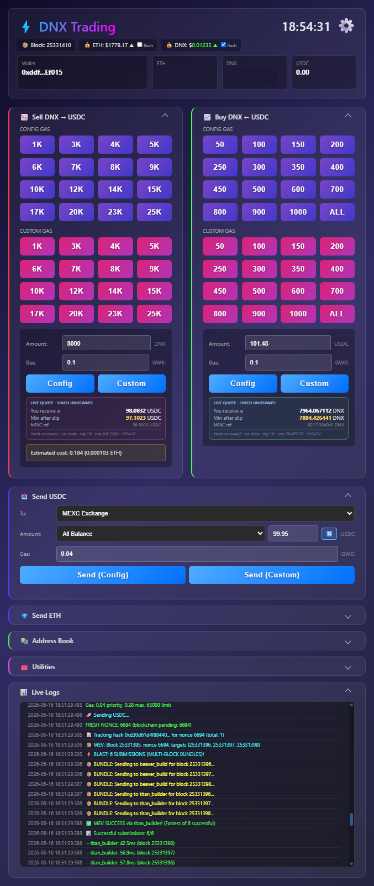
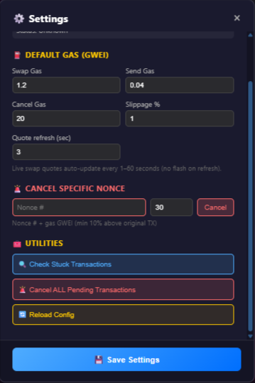

# DEX Swapper



Classic **web DEX interfaces** (1inch, Uniswap, aggregators in the browser) are built for casual users: connect wallet, approve, pick route, confirm in MetaMask, wait for RPC, hope the mempool does not sandwich you. For an operator running **dozens of size ladders per session**, that model breaks down — every swap becomes ten UI steps, unpredictable latency, and zero control over gas tiers or recovery when a nonce sticks.

**DEX Swapper** is a **single-page operator console** wired to your own key and node. Today it targets **Dynex (DNX) ⇄ USDC on Ethereum**; the same preset-ladder + MEV pipeline can host additional pairs later. One click runs a pre-built swap path: live quote visible, config gas from JSON tables, parallel private-builder submission, and live logs — no wallet pop-up chain, no tab switching, no guessing whether the tx landed.

**Why speed matters:** DNX moves on CEX tape and thin pools. The difference between a **one-click preset** and a browser DEX flow is often **seconds vs tens of seconds** — enough to miss a ladder step or eat slippage. The app optimizes the hot path: transaction templates pre-built at startup, base fee from `newHeads` WebSocket (no extra `get_block` per swap), balances and quotes cached in RAM, and **swap-in-progress lock** so you cannot double-fire while a bundle is in flight.

**Typical flows:** ladder out DNX after a CEX move → **CONFIG GAS** sell size → **Config** with live quote → **Live Logs** for builder blast. Buy the dip → **Buy DNX ← USDC** preset → **Custom** priority fee when mempool spikes. Move proceeds → **Send USDC** to MEXC from address book. Stuck nonce → **Settings** → **Check Stuck** → **Cancel Specific Nonce** or **Cancel ALL**. Tune gas bands → edit `dex_swapper_gas_config.json` → **Reload Config** without restart.

## Tech stack

| Layer | Technologies |
|-------|--------------|
| Backend | Python 3, FastAPI, uvicorn, asyncio |
| Chain | Web3.py — 1inch `unoswap2` router, ERC-20 transfers, EIP-1559 |
| Pricing | MEXC protobuf WebSocket (ETHUSDT, DNXUSDT) + on-chain pool reference |
| Block head | `eth_subscribe` `newHeads` — block number + base fee cached in RAM |
| MEV | Persistent HTTP to BeaverBuild + Titan; parallel multi-block bundle blast |
| Quotes | On-chain `unoswap2` `eth_call` only for `minReturn` (no stale CEX fallback) |
| UI | Embedded HTML/CSS/JS — dark operator theme, collapsible panels |
| Streaming | WebSocket `/ws/logs` — logs, blocks, prices, balances, swap state |
| Config | `dex_swapper_gas_config.json` (gas tiers), `ui_config.json` (presets, nodes) |
| Secrets | `.env` — key, RPC URLs, builder endpoints (**private repo only**) |

## Problems this replaces (browser DEX workflow)

| Pain in browser swappers | DEX Swapper approach |
|--------------------------|----------------------|
| MetaMask confirm on every trade | Server-side sign; operator clicks **Config** / **Custom** once |
| Route UI + slippage modals | Fixed 1inch path; slippage % in **Settings** |
| Gas guessed by wallet | **CONFIG GAS** tiers by size band, or manual GWEI |
| No preset ladders | Purple/pink grids — 16+ sell sizes, 15+ buy notionals |
| Public mempool exposure | **Private MEV builders only** — no public broadcast fallback |
| Sandwich / frontrun anxiety | Block monitor + known attacker watch → **auto cancel all pending** |
| Stuck pending invisible | **Check Stuck**, nonce scan, cancel via builders |
| Balances in another tab | Header wallet card + auto refresh (~6 s) |
| No session log | **Live Logs** WebSocket stream in-page |

## MEV protection and sandwich response

Swaps do **not** rely on the public mempool as the primary path. Signed raw transactions go to **BeaverBuild** and **Titan** in parallel, targeting **multiple future blocks** per submit. Builder HTTP sessions stay warm with keep-alive pings between trades.

| Mechanism | Behavior |
|-----------|----------|
| **Parallel blast** | All active builders × block targets fired concurrently; fastest accept wins |
| **Re-blast monitor** | If receipt missing ~24 s (~2 blocks), raw tx re-submitted to builders |
| **No mempool fallback** | Monitor loop does not drop to public `eth_sendRawTransaction` for swaps |
| **Cancel via builders** | Stuck swap/send cancel uses same builder path with USD cost ceiling |
| **Attacker block watch** | Each `newHeads` block scanned; tx `from` matching configured sandwich bot → **Cancel ALL Pending** immediately |
| **Swap lock** | `swap_in_progress` blocks second submit until current nonce path clears |

This is **operator-grade MEV routing**, not a consumer “shield” toggle — you see every builder accept/reject in **Live Logs**.

## Performance optimizations (hot path)

- **Pre-built transaction templates** for DNX→USDC and USDC→DNX at startup — click only fills amount + `minReturn`.
- **Base fee from WebSocket** — `baseFeePerGas` in block header updates `global_block`; gas math avoids RPC on every swap when feed is fresh (&lt;15 s).
- **Single nonce RPC** — tracked nonce increments locally; `get_transaction_count(pending)` only when needed.
- **Silent balance refresh** — background poll without spamming the log panel.
- **Quote simulation** — USDC balance/allowance state override for `eth_call` when wallet USDC is zero but sell quote is needed.
- **Fixed gas limits** per operation type (sell / buy / send) — no `estimate_gas` round-trip on the critical path.
- **Config reload** — gas JSON + UI JSON re-read via API without process restart.

## Header — chain context and wallet

| Element | Role |
|---------|------|
| **Clock** | Local session time |
| **Block** | Latest head from block monitor (same WS feed as base fee) |
| **ETH price** | MEXC tape; flash on tick |
| **DNX price** | MEXC + on-chain ref; direction arrow |
| **Wallet card** | ETH, DNX, USDC with USD sublabels (auto refresh) |
| **Settings** | Gear → modal below |

## Sell DNX → USDC and Buy DNX ← USDC

Side-by-side cards for ladder trading.

### Preset grids

| Grid | Behavior |
|------|----------|
| **CONFIG GAS** (purple) | Amount from `ui_config.json`; priority fee + base-fee multiplier from `dex_swapper_gas_config.json` per band |
| **CUSTOM GAS** (pink) | Same amounts; operator types priority GWEI → **Custom** |

**Sell** — ladder from small clips to large (configurable). **Buy** — USDC notionals + **ALL** (full balance, rounded down).

### Live quote panel

**LIVE QUOTE** polls on-chain `unoswap2` (1inch). Shows **You receive**, **Min after slip**, **MEXC ref**. Refresh interval 1–60 s from settings. **Estimated cost** (ETH + USD) under sell card.

Execution uses on-chain quote for `minReturn` only — swap blocked if `unoswap2` fails (never silent CEX fallback).

## Send USDC and Send ETH

Collapsible panels — exchange withdrawals without leaving the app.

- **Send USDC** — address book dropdown (MEXC, Gate.io, custom), amount presets, **All Balance**, Config/Custom gas.
- **Send ETH** — same pattern; collapsed by default in panel order.

## Address book

Named withdrawal targets; CRUD in UI; feeds send dropdowns.

## Node settings

Switch **local Geth**, **Infura**, **Alchemy**, **QuickNode** from `ui_config.json`. **Test node** / **Check node health** before size. Startup **node sync check** compares local head vs public RPC latency and sync status.

## Utilities panel

Shortcuts for nonce hygiene (detailed actions also in Settings modal).

## Settings modal



### Default gas (GWEI)

| Field | Purpose |
|-------|---------|
| **Swap Gas** | Default priority for swaps |
| **Send Gas** | USDC/ETH sends |
| **Cancel Gas** | Cancel transactions |
| **Slippage %** | `minReturn` tolerance |
| **Quote refresh (sec)** | Live quote poll (1–60) |

**Save Settings** → `ui_config.json`.

### Cancel specific nonce

Nonce # + gas GWEI → on-chain cancel through builders (cost ceiling).

### Utilities

| Action | Effect |
|--------|--------|
| **Check Stuck Transactions** | Wide block scan; lists pending vs confirmed — no auto-cancel |
| **Cancel ALL Pending** | Builder cancels for every tracked nonce |
| **Reload Config** | Hot reload `dex_swapper_gas_config.json` + `ui_config.json` |

## Live logs

WebSocket stream: gas picks, quotes, balances, blocks, MEV builder traffic, swap lifecycle, attacker alerts. Use instead of SSH `tail` during active sessions.

## Recovery and safety

- **Cancel current swap** / **Cancel current send** — active nonce only
- **Nonce status** — blockchain pending vs locally tracked (MetaMask desync diagnosis)
- **Deep stuck scan** — per-nonce tx history across thousands of blocks
- **Cancel all** — emergency clear

Operator tools — validate on small size first.

## Configuration files

| File | Role |
|------|------|
| `dex_swapper_gas_config.json` | Amount bands → priority fee + base-fee multiplier |
| `ui_config.json` | Presets, panel order, address book, node profiles, defaults |
| `.env` | Private key, API keys — **private repo only** |

## Quick start

```bash
python3 dex_swapper.py
```

Port from `ui_config.json` (commonly `8024`).

Private implementation: [logicencoder/dex-swapper](https://github.com/logicencoder/dex-swapper).

See [REPOS.md](REPOS.md) for repository links.

---

**Made by [Logic Encoder](https://logicencoder.com)** · [GitHub](https://github.com/logicencoder) · [Contact](https://logicencoder.com/contact/)
